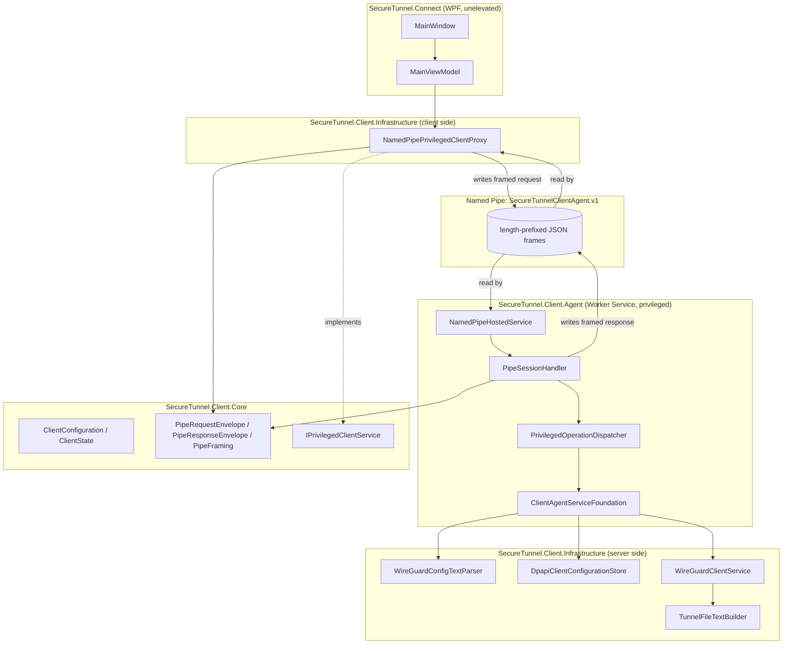

# Architecture

## Status

- **Implemented:** four-project solution layout plus a new `SecureTunnel.Client.Connect.Tests` project, a complete WireGuard `[Interface]`/`[Peer]` configuration model/parser/generator, a WireGuard connection engine with real interface/handshake verification (`WireGuardDumpParser`), a real .NET 10 Worker Service hosting a hardened Named Pipe transport, a WPF-facing `IPrivilegedClientService` proxy, and a usable WPF shell (import flow, connection controls, diagnostics, system tray) wired to that proxy.
- **Tested / Passed:** 137/137 automated xUnit tests passing across Core, Infrastructure, Agent, and the new Connect ViewModel tests, including real in-process Named Pipe round trips and a real-child-process timeout/kill test (see `testing-guide.md`).
- **Not Implemented / Blocked:** an actually-installed Windows Service, real WireGuard connectivity, a real cross-identity pipe access test, interactive WPF UI automation (tray icon, file dialog, clipboard) - see `windows-service-boundary.md`, `ipc-protocol.md`, and `windows-service-installation.md`.

## Layers

SecureTunnel Connect is split into four projects with a strict, one-directional dependency chain:

```
SecureTunnel.Client.Core            (no dependencies)
        ^
        |
SecureTunnel.Client.Infrastructure  (implements Core interfaces: DPAPI storage, WireGuard process adapter, config parser, Named Pipe client proxy)
        ^
        |
SecureTunnel.Client.Agent           (Worker Service host: privileged operation contract + foundation handler + Named Pipe server)
        ^
        |
SecureTunnel.Connect                (WPF UI - presentation only, depends on Core + Infrastructure, never on Agent)
```

- **`SecureTunnel.Client.Core`** - domain models (`ClientConfiguration` with a complete Peer identity, `ClientState`), interfaces (`IClientConfigurationParser`, `IClientConfigurationStore`, `IWireGuardClientService`, `IPrivilegedClientService`), the client state machine, validation and diagnostics types, and the Named Pipe wire-protocol types (`Client/Ipc/`: `PipeProtocol`, `PipeRequestEnvelope`, `PipeResponseEnvelope`, `PipeFraming`) shared by both the server (Agent) and client (Infrastructure) sides of the pipe. No I/O beyond generic `Stream` framing, no Windows-specific APIs, `net10.0` (platform-neutral) so it is trivially unit-testable.
- **`SecureTunnel.Client.Infrastructure`** - concrete, Windows-specific implementations: `WireGuardConfigTextParser`, `TunnelFileTextBuilder` (generates a complete `[Interface]`+`[Peer]` document), `DpapiClientConfigurationStore`, `WireGuardClientService`, and `NamedPipePrivilegedClientProxy` (the client side of the IPC transport, implementing `IPrivilegedClientService`). Targets `net10.0-windows`.
- **`SecureTunnel.Client.Agent`** - now a real .NET 10 Worker Service (`Microsoft.Extensions.Hosting` + `UseWindowsService`). Hosts `NamedPipeHostedService` (a `BackgroundService` that accepts pipe connections on the fixed pipe name and hands each off to `PipeSessionHandler`), which dispatches through the existing `PrivilegedOperationDispatcher`/`ClientAgentServiceFoundation`/`IPrivilegedOperationHandler` chain from Phase C1. See `windows-service-boundary.md` and `ipc-protocol.md`.
- **`SecureTunnel.Connect`** - WPF presentation layer. Runs unelevated (`app.manifest` requests `asInvoker`). `MainViewModel` composes `ImportViewModel` (file-picker-driven import + validation display) and `DiagnosticsViewModel` (agent/pipe/WireGuard availability + redacted diagnostic text), depends on `IPrivilegedClientService` (constructor-injected; `NamedPipePrivilegedClientProxy` in production, `FakePrivilegedClientService` in tests), and exposes Connect/Disconnect/RefreshStatus commands. `App.xaml.cs` also owns a `Services/TrayIconService` (`System.Windows.Forms.NotifyIcon`, no new NuGet dependency) - closing the main window hides it to the tray rather than exiting, and neither hiding nor restoring ever touches the Agent connection. Still no privileged logic in this project - it references Core + Infrastructure, never Agent.

## Component diagram



## Why the UI and the privileged service are separate

WireGuard tunnel management and DPAPI-protected key storage require elevated or otherwise privileged access on Windows. If that logic lived inside the WPF process, either the whole UI would need to run elevated (a poor, risky experience for a "double-click and connect" client) or the UI process itself would become the thing an attacker needs to compromise to reach privileged operations. Isolating privileged operations behind `SecureTunnel.Client.Agent`'s narrow, allow-listed contract - now actually crossing a real process boundary via the Named Pipe transport, not just an in-process interface - means the UI process never holds elevated rights and never has direct access to WireGuard binaries, DPAPI-protected storage, or key material. It can only ask for one of four pre-defined operations, and only ever receives status/outcome metadata back, never a key.
